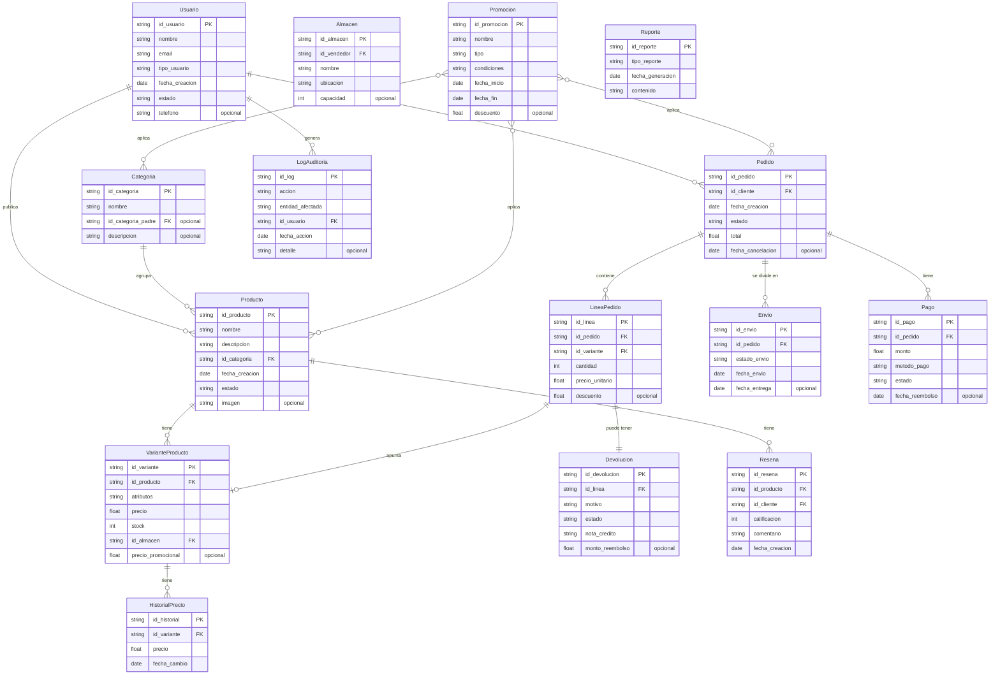

# Identificacion de Entidades

## Entidades
1. **Usuario**: Representa a los usuarios del sistema, que pueden ser clientes, vendedores o ambos.
2. **Producto**: Articulos que los vendedores ponen a la venta.
3. **VarianteProducto**: Variantes de un producto, como talla o color.
4. **Categoria**: Clasificacion jerarquica de los productos.
5. **Almacen**: Lugares donde los vendedores almacenan su inventario.
6. **Pedido**: Compras realizadas por los clientes.
7. **LineaPedido**: Detalles de los productos en un pedido.
8. **Envio**: Agrupacion de lineas de pedido para su transporte.
9. **Pago**: Registro de pagos asociados a pedidos.
10. **Devolucion**: Registro de devoluciones de productos.
11. **Promocion**: Descuentos o beneficios aplicables a productos, categorias o pedidos.
12. **Resena**: Opiniones y calificaciones de los clientes sobre los productos.
13. **HistorialPrecio**: Registro de cambios de precio de las variantes de productos.
14. **LogAuditoria**: Registro de acciones importantes en el sistema.
15. **Reporte**: Generacion de reportes sobre ventas, stock y pedidos.

---

# Identificacion de Relaciones

## Relaciones
1. **Usuario - Producto**
   - **Relacion**: Un Usuario (Vendedor) publica varios Productos.
   - **Verbo inverso**: Un Producto pertenece a un Usuario.
   - **Cardinalidad**: 1:N
   - **Nota**: Solo aplica para usuarios de tipo Vendedor.

2. **Producto - VarianteProducto**
   - **Relacion**: Un Producto tiene varias Variantes.
   - **Verbo inverso**: Una Variante pertenece a un Producto.
   - **Cardinalidad**: 1:N

3. **Categoria - Producto**
   - **Relacion**: Una Categoria agrupa varios Productos.
   - **Verbo inverso**: Un Producto pertenece a una Categoria.
   - **Cardinalidad**: 1:N

4. **Usuario - Pedido**
   - **Relacion**: Un Usuario (Cliente) realiza varios Pedidos.
   - **Verbo inverso**: Un Pedido pertenece a un Usuario.
   - **Cardinalidad**: 1:N

5. **Pedido - LineaPedido**
   - **Relacion**: Un Pedido contiene varias Lineas de Pedido.
   - **Verbo inverso**: Una Linea pertenece a un Pedido.
   - **Cardinalidad**: 1:N

6. **LineaPedido - VarianteProducto**
   - **Relacion**: Una Linea de Pedido apunta a una Variante de Producto.
   - **Verbo inverso**: Una Variante puede estar en varias Lineas.
   - **Cardinalidad**: N:1

7. **Pedido - Envio**
   - **Relacion**: Un Pedido puede dividirse en varios Envios.
   - **Verbo inverso**: Un Envio pertenece a un Pedido.
   - **Cardinalidad**: 1:N

8. **Pedido - Pago**
   - **Relacion**: Un Pedido puede tener varios Pagos.
   - **Verbo inverso**: Un Pago pertenece a un Pedido.
   - **Cardinalidad**: 1:N

9. **LineaPedido - Devolucion**
   - **Relacion**: Una Linea de Pedido puede tener una Devolucion.
   - **Verbo inverso**: Una Devolucion pertenece a una Linea.
   - **Cardinalidad**: 1:1

10. **Producto - Resena**
    - **Relacion**: Un Producto puede tener varias Resenas.
    - **Verbo inverso**: Una Resena pertenece a un Producto.
    - **Cardinalidad**: 1:N

11. **VarianteProducto - HistorialPrecio**
    - **Relacion**: Una Variante tiene un Historial de Precios.
    - **Verbo inverso**: Un Historial pertenece a una Variante.
    - **Cardinalidad**: 1:N

12. **Usuario - LogAuditoria**
    - **Relacion**: Un Usuario genera varios Logs de Auditoria.
    - **Verbo inverso**: Un Log pertenece a un Usuario.
    - **Cardinalidad**: 1:N

13. **Promocion - Producto**
    - **Relacion**: Una Promocion puede aplicarse a varios Productos.
    - **Verbo inverso**: Un Producto puede tener varias Promociones.
    - **Cardinalidad**: N:M

14. **Promocion - Categoria**
    - **Relacion**: Una Promocion puede aplicarse a varias Categorias.
    - **Verbo inverso**: Una Categoria puede tener varias Promociones.
    - **Cardinalidad**: N:M

15. **Promocion - Pedido**
    - **Relacion**: Una Promocion puede aplicarse a varios Pedidos.
    - **Verbo inverso**: Un Pedido puede tener varias Promociones.
    - **Cardinalidad**: N:M

---

# Atributos de las Entidades

## Usuario
- `id_usuario` (PK)
- `nombre`
- `email`
- `tipo_usuario` (Cliente, Vendedor o ambos)
- `fecha_creacion`
- `estado` (activo/inactivo)
- **Opcionales**:
  - `telefono`

## Producto
- `id_producto` (PK)
- `nombre`
- `descripcion`
- `id_categoria` (FK a Categoria)
- `fecha_creacion`
- `estado` (activo/inactivo)
- **Opcionales**:
  - `imagen`

## VarianteProducto
- `id_variante` (PK)
- `id_producto` (FK a Producto)
- `atributos` (ej. talla, color)
- `precio`
- `stock`
- `id_almacen` (FK a Almacen)
- **Opcionales**:
  - `precio_promocional`

## Categoria
- `id_categoria` (PK)
- `nombre`
- `id_categoria_padre` (FK a si misma, opcional para jerarquia)
- **Opcionales**:
  - `descripcion`

## Almacen
- `id_almacen` (PK)
- `id_vendedor` (FK a Usuario)
- `nombre`
- `ubicacion`
- **Opcionales**:
  - `capacidad`

## Pedido
- `id_pedido` (PK)
- `id_cliente` (FK a Usuario)
- `fecha_creacion`
- `estado` (pendiente, completado, cancelado)
- `total`
- **Opcionales**:
  - `fecha_cancelacion`

## LineaPedido
- `id_linea` (PK)
- `id_pedido` (FK a Pedido)
- `id_variante` (FK a VarianteProducto)
- `cantidad`
- `precio_unitario`
- **Opcionales**:
  - `descuento`

## Envio
- `id_envio` (PK)
- `id_pedido` (FK a Pedido)
- `estado_envio` (pendiente, enviado, entregado)
- `fecha_envio`
- **Opcionales**:
  - `fecha_entrega`

## Pago
- `id_pago` (PK)
- `id_pedido` (FK a Pedido)
- `monto`
- `metodo_pago`
- `estado` (exitoso, fallido, reembolsado)
- **Opcionales**:
  - `fecha_reembolso`

## Devolucion
- `id_devolucion` (PK)
- `id_linea` (FK a LineaPedido)
- `motivo`
- `estado`
- `nota_credito`
- **Opcionales**:
  - `monto_reembolso`

## Promocion
- `id_promocion` (PK)
- `nombre`
- `tipo` (producto, categoria, vendedor, pedido)
- `condiciones`
- `fecha_inicio`
- `fecha_fin`
- **Opcionales**:
  - `descuento`

## Resena
- `id_resena` (PK)
- `id_producto` (FK a Producto)
- `id_cliente` (FK a Usuario)
- `calificacion`
- `comentario`
- `fecha_creacion`

## HistorialPrecio
- `id_historial` (PK)
- `id_variante` (FK a VarianteProducto)
- `precio`
- `fecha_cambio`

## LogAuditoria
- `id_log` (PK)
- `accion` (creacion, actualizacion, eliminacion)
- `entidad_afectada`
- `id_usuario` (FK a Usuario)
- `fecha_accion`
- **Opcionales**:
  - `detalle`

## Reporte
- `id_reporte` (PK)
- `tipo_reporte` (ventas, stock, pedidos)
- `fecha_generacion`
- `contenido`

## DER Conceptual

